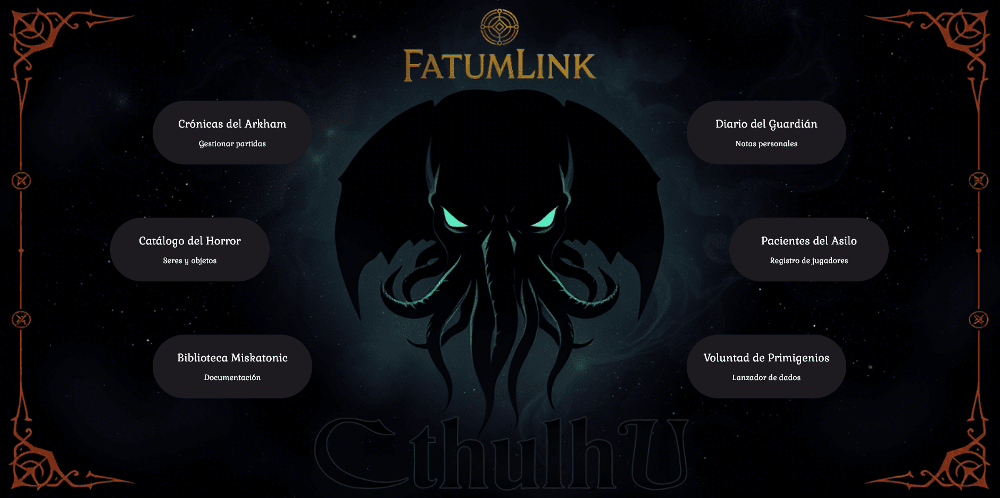
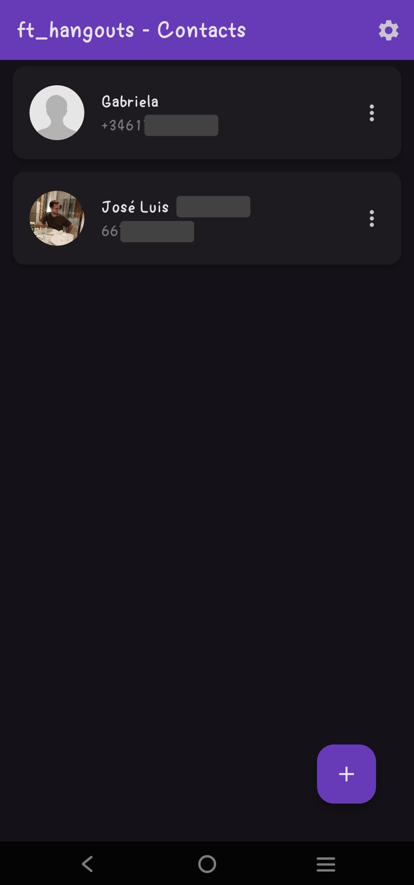

# 🚀 Pablo Vílchez | Full-Stack & Flutter Developer

Welcome to my professional portfolio! I am a software engineer specialized in building robust, scalable applications using **Flutter**, **Dart**, and modern **Full-Stack** technologies. This repository showcases my journey through 42 projects and beyond.

---

## ⭐ Star Project: Mi Fortitú

**Mi Fortitú** is a comprehensive full-stack ecosystem designed specifically for the 42 student community. It has evolved from a simple mobile app into a robust platform with a custom Dart backend.

  
  
  
  

- **Tech Stack**: Flutter, Serverpod (Dart Backend), PostgreSQL, BLoC, OAuth2.
- **Key Features**: Dual Auth (App + 42 API), Real-time cluster mapping, peer locator, event management, and more.
- **Status**: Currently in Closed Beta for Android users.

[Explore Mi Fortitú Details](./projects/mi%20fortitu.md)

---

## 📱 Flutter & Mobile Development

| Project | Preview | Description |
| :--- | :---: | :--- |
| **FatumLink Cthulhu** |  | Desktop tool for running *Call of Cthulhu* RPG sessions. Features local database management with Drift/SQLite. [View](./projects/fatumlink%20cthulhu.md) |
| **Hangouts** |  | A sleek contacts and messaging app with SMS functionality, built to explore complex UI patterns in Flutter. [View](./projects/hangouts.md) |

---

## 🖥️ Systems & Full-Stack (42 Curriculum)

Mastering low-level programming, networking, and complex architecture.

<table border="0">
  <tr>
    <td width="50%">
      
       
      <b>Transcendence</b> 
      Real-time multiplayer Pong web app. TypeScript, NestJS, WebSockets, Docker. 
      <a href="./projects/transcendence.md">View Details</a>
    </td>
    <td width="50%">
      
       
      <b>Cub3D</b> 
      A minimalistic 3D raycasting engine from scratch in C, inspired by Wolfenstein 3D. 
      <a href="./projects/cub3d.md">View Details</a>
    </td>
  </tr>
  <tr>
    <td width="50%">
      
       
      <b>Inception</b> 
      Containerized ecosystem (Nginx, MariaDB, Wordpress, Redis) following infrastructure-as-code principles. 
      <a href="./projects/inception.md">View Details</a>
    </td>
    <td width="50%">
      
       
      <b>Webserv</b> 
      A fully functional HTTP/1.1 server built from scratch in C++, featuring non-blocking I/O. 
      <a href="./projects/webserv.md">View Details</a>
    </td>
  </tr>
</table>

---

## 📬 Contact & Code Access

The source code for most of these projects is **private**. If you are a recruiter or developer interested in a technical review:

1. **Email me**: [pablovilchez.r@gmail.com](mailto:pablovilchez.r@gmail.com)
2. **Include the project name** you're interested in.
3. I will invite you as a collaborator to the specific GitHub repository.

---

  <i>"Code is not just instructions for a computer, it's a way to solve human problems."</i>

