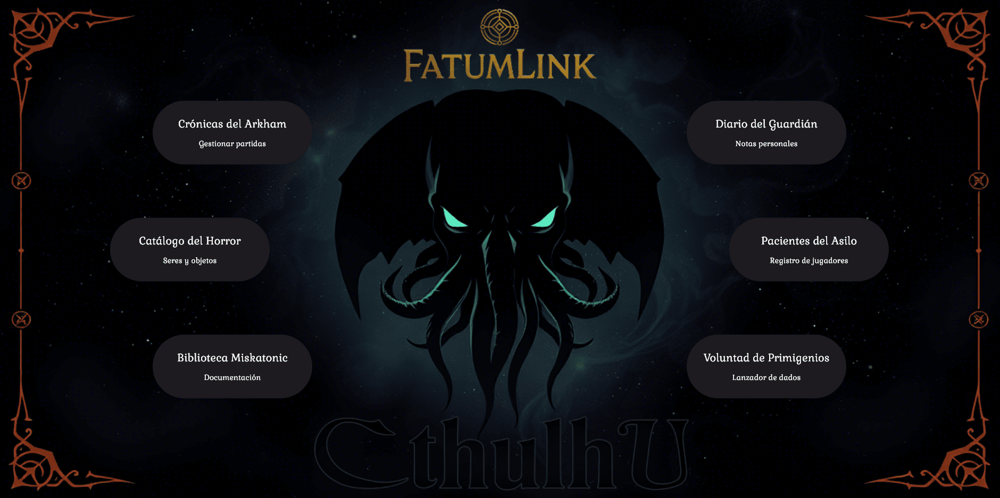
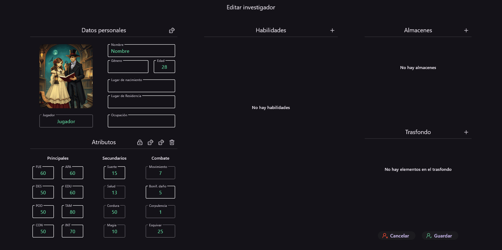

# 📌 Nombre del Proyecto

**Type:** Desktop app
**Tecnologies:** Flutter, Bloc, Drift Database  
**Status:** In development

---

## 📖 Description
Application for directing role-playing games of "Cthulhu" in which you can create characters, create adventure stories and manage the characters created.

---

## ✨ Highlighted Features
- 🎲 **Dynamic Character Creation**: Build and customize investigators with detailed personal data, attributes, and combat stats.
- 🗂️ **Resource Management**: Manage investigators, NPCs, monsters, items, and vehicles from a centralized dashboard.
- 🧠 **Smart Attribute Calculations**: Automatically compute derived stats like dodge, movement, and damage bonuses.
- 🛠️ **Flexible Inventory System**: Assign, transfer, and manage items between characters or locations.
- 📜 **Backstory & Skills Integration**: Add skills, specializations, and detailed backstories for richer gameplay.
- 🎮 **Game Session Dashboard** – Visualize and interact with all players during a session, including health, sanity, and magic.
- 💾 **Persistent Data** – All resources are stored locally and can be updated in real-time.
- 🌐 **Multi-language Support** – Interface supports localization for multiple languages.

---

## 🖼️ Screenshots
  

---

## 🏗️ Challenges
- Managing complex character entities with multiple interdependent attributes and derived stats.
- Keeping the UI performant while updating nested data in real-time during gameplay.
- Designing a flexible resource management system that accommodates investigators, NPCs, monsters, items, and vehicles.
- Implementing a consistent state management strategy across multiple features and interactive forms.

---

## 📅 Timeline
- **Development started:** 06/2025
- **Stable release:**
- **Last update:**
