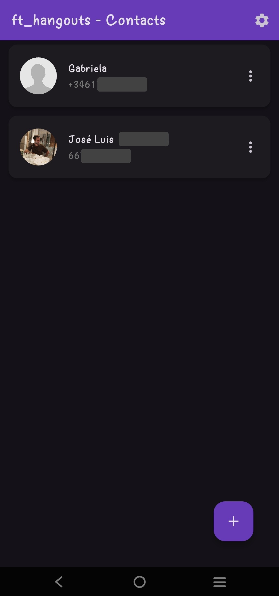
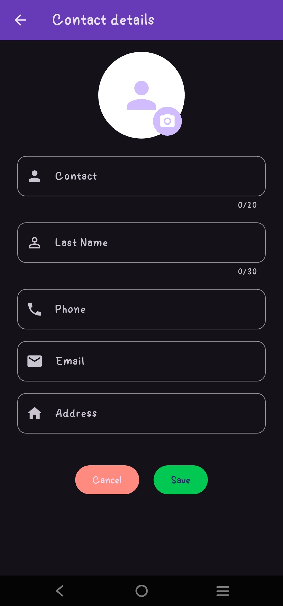
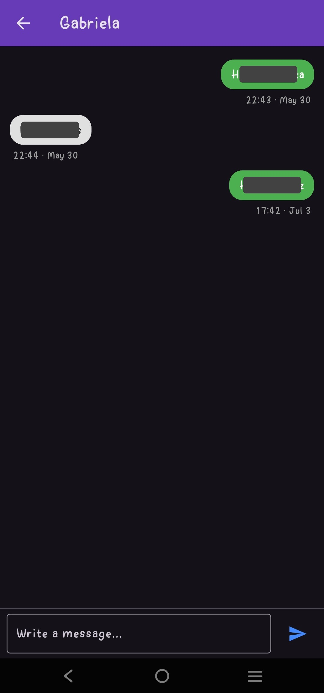
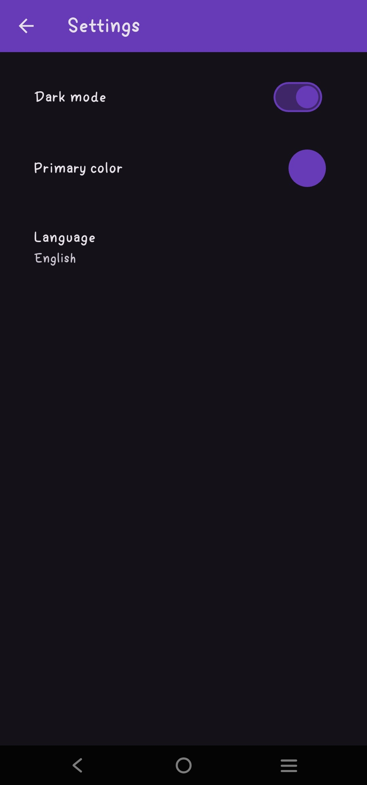

# 📌 Hangouts

**Type:** Mobile app  
**Tecnologies:** Flutter, Dart, Bloc, Native APIs 
**Status:** Completed

---

## 📖 Description
ft_hangouts is a mobile contacts and messaging app developed as part of the 42 curriculum. The app allows users to manage contacts, send and receive messages in an SMS chat interface.

Designed with Flutter, it demonstrates cross-platform mobile development skills, state management with Bloc, and integration with device-level features such as contacts and messaging APIs.

---

## ✨ Highlighted Features
- 📱 **Contacts Management**: Add, edit, and delete contacts stored locally.
- 💬 **SMS Chat**: Real-time messaging interface with chat bubbles and timestamps.
- ⚡ **State Management**: Bloc pattern ensures predictable UI updates and app responsiveness.
- 📲 **Native Integration**: Access device contacts and SMS APIs.

---

## 🖼️ Screenshots

  
  
  
  

---

## 🏗️ Challenges
- Implementing reliable local storage and synchronization for contacts.
- Integrating device-specific APIs for messaging.
- Managing app state across multiple screens with Bloc to avoid UI inconsistencies.
- Designing a user-friendly and responsive chat interface.

---

## 📅 Timeline
- **Development started:** 05/2024
- **Stable release:**
- **Last update:** 07/2025
