# 📌 Mi Fortitú

**The Ultimate Ecosystem for 42 Students**

**Type:** Full-Stack Mobile App  
**Core Technologies:** Flutter, Serverpod, Dart (Backend), PostgreSQL, BLoC/Cubit, OAuth2, Clean Architecture  
**Status:** Currently in Testing Phase (Android & iOS)

---

## 📖 Description
Designed for 42 students who want to improve their daily campus experience. Originally developed as a personal specialization project in Flutter and Supabase, the app has evolved into a robust full-stack solution. It now features a custom Dart backend powered by Serverpod, ensuring type safety and seamless code sharing between the client and the server.

The app connects both to its custom backend and the official 42 API, offering many of the web's services with a tailored mobile experience, with the intention of continuing to implement those that are missing. It is designed for academic and competitive use on 42 campuses, offering campus information, league and tournament tools, event management, and much more.

---

## 🧪 Testing Phase (Android & iOS)
Currently, **Mi Fortitú** is in a closed beta testing phase and is available for both **Android** and **iOS** devices. 

⚠️ **Exclusive for 42 Students:** This application is strictly intended for active 42 students.

If you are a 42 student and would like to participate as a beta tester to help find bugs or suggest improvements, please send a direct message on **Slack** to my login: **`pvilchez`**.  
*You will receive instructions and an invitation to download the test version.*

---

## ✨ Highlighted Features
- 🔐 **Authentication System**: Seamless In-App WebView OAuth2 flow for the 42 Intra API.
- 👥 **Role-Based Access Control (RBAC)**: A custom system implementing roles for students, testers, staff, and administrators.
- 📱 **Academic Information**: Keep track of students' levels, skills, projects, and assessments.
- ♣️ **Clubs**: A new section where users can link a personal or group website, making it accessible and visitable directly from the app.
- ☕ **Minigame (In Development)**: An interactive pet that you can feed coffee to keep it energized.
- 🎮 **Events**: List of upcoming events, detailed descriptions, and quick subscription options.
- 🌍 **Evaluation Slots**: Easily create and delete slots by hour or duration, and view upcoming reservations.
- 🔒 **Peer 2 Peer**: Find students who are working on the same project, and pinpoint their location if they are online on campus.
- 🎯 **Clusters**: View online students and track their specific location within the campus clusters.
- 🏆 **Coalitions**: Check the live ranking of the cursus coalitions.
- ⚙️ **User Engagement**: Built-in feedback system for users to report bugs or suggest enhancements directly to administrators.

---

## ⚙️ Backend & Architecture (Serverpod)
- 🚀 **100% Dart Stack**: Unified language for both frontend and backend, allowing shared models, endpoints, and validation logic.
- 🗄️ **PostgreSQL Database**: Relational database handling user settings, feedbacks, waitlists, and custom app features.
- 🛡️ **Session Management**: Secure token handling, silent token refreshing, and strict endpoint access control based on the 42 API OAuth2 session.
- 🧱 **Clean Architecture Core**: Strict separation of concerns (Data, Domain, Presentation layers) extended from the frontend to handle external API integrations robustly.

---

## 🖼️ Screenshots

  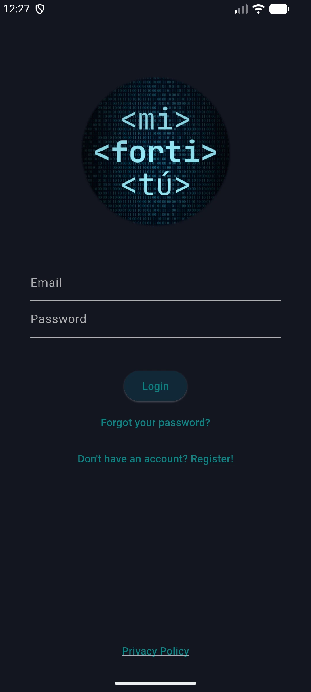
  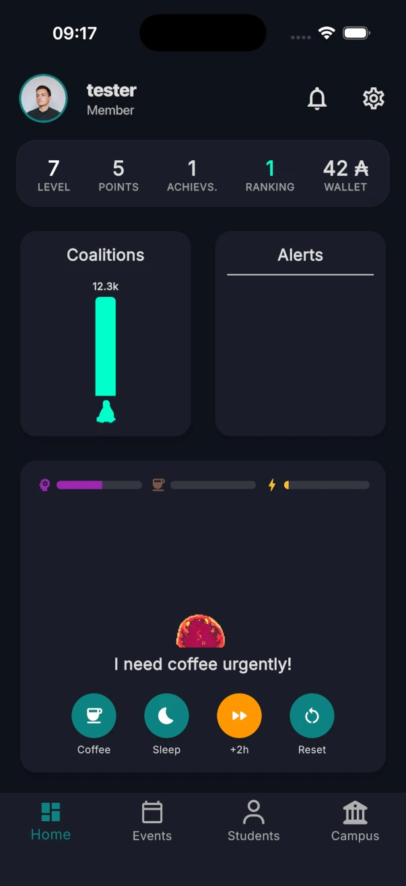
  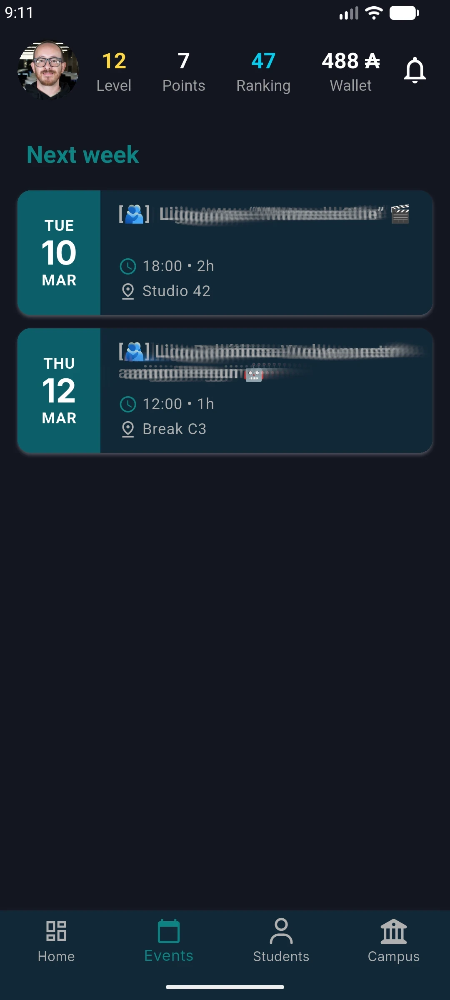
  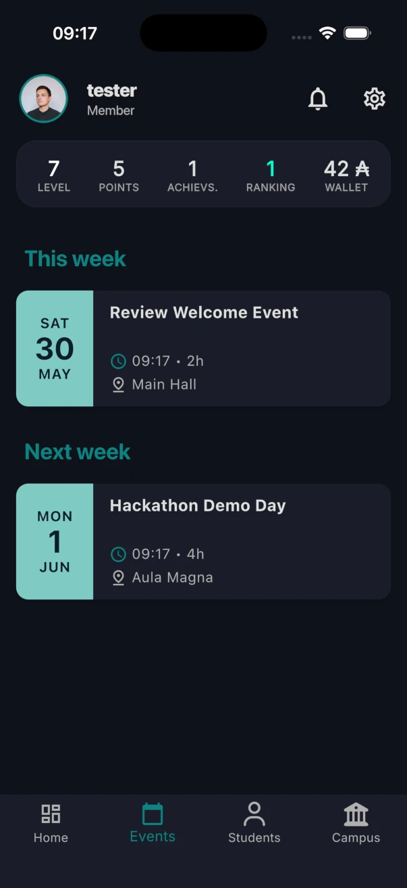
  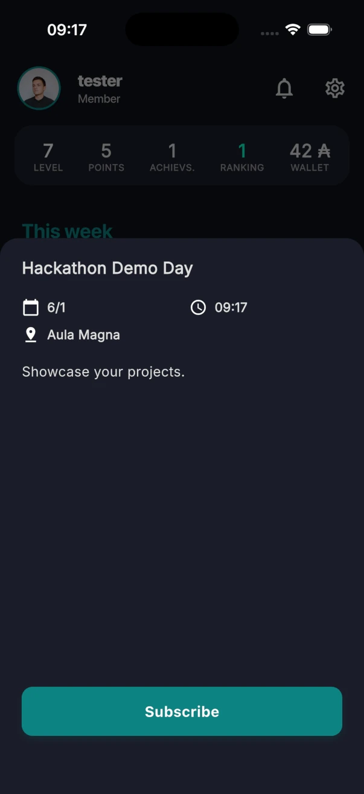
  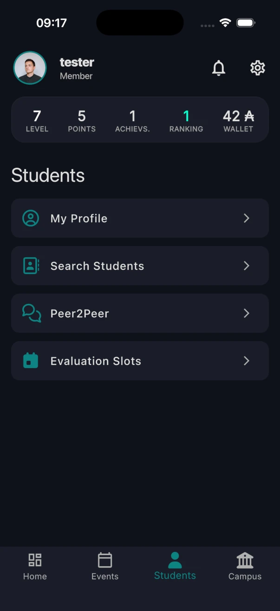
  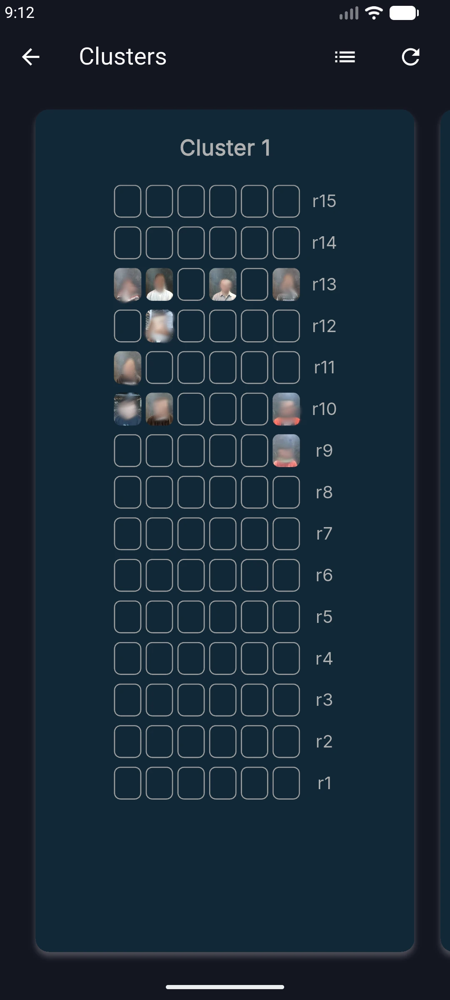
  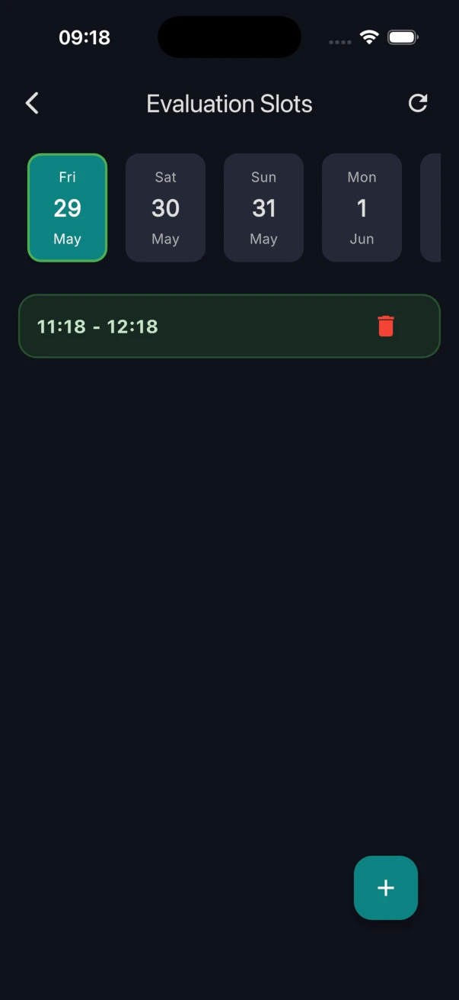
  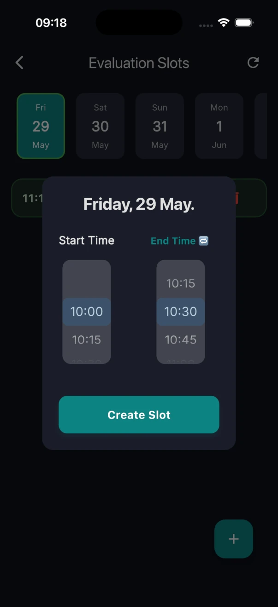
  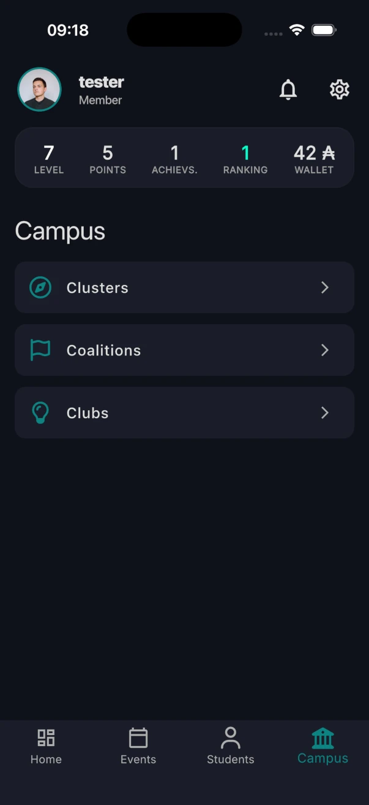
  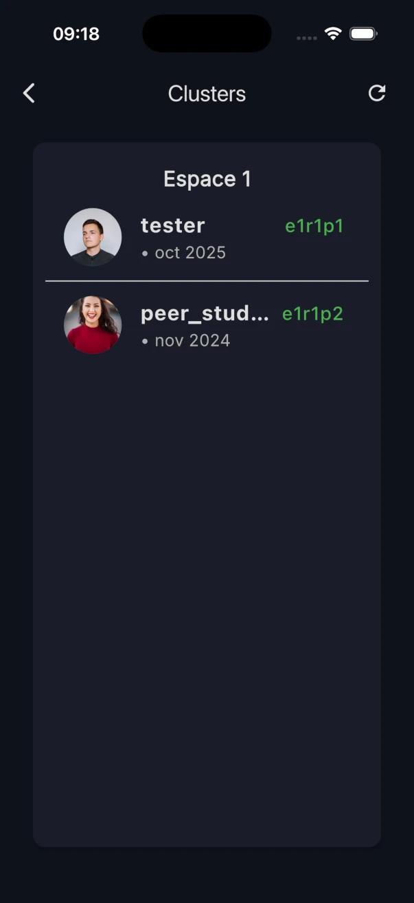

---

## 🏗️ Challenges
- **Migrating to a Custom Backend** – Moving from BaaS (Supabase) to a fully custom Serverpod backend, meaning designing the database schemas, writing custom endpoints, and handling server-side authentication manually.
- **Complex Authentication Flows** – Orchestrating the 42 Intra API OAuth2 session lifecycle within the app, including an in-app WebView integration for seamless UX.
- **Scalable State Management** – Coordinating multiple Cubits/Blocs across screens, managing caching for heavy API calls (like campus layouts), and ensuring predictable UI updates.
- **Clean Architecture Maintenance** – Balancing feature-based organization with shared core elements across both the Flutter client and the Serverpod server without duplicating logic.

---

## 📅 Timeline
- **Concept & Initial Flutter Development:** 12/2024
- **Beta Release (BaaS Edition):** 07/2025
- **Fullstack Migration (Serverpod):** 03/2026
- **Google Play & Apple App Store Beta Release:** 05/2027
- **Current Stable Version:** 2.2.2
