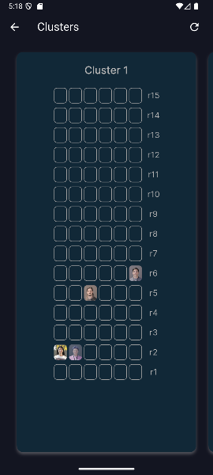
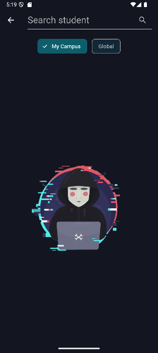

# 📌 Mi Fortitú

**Type:** Multiplatform app  
**Tecnologies:** Flutter, Bloc, REST API, OAuth2, Supabase, Clean Architecture  
**Status:** Beta

---

## 📖 Description
Designed for 42 students who want to improve their daily campus experience. Originally developed as a personal specialization project in Flutter, the app has evolved into a tool connected to the official 42 API, offering many of the web's services, with the intention of continuing to implement those that are missing.

The app is designed for academic and competitive use on 42 campuses, and offers campus information, league and tournament tools, and much more.

---

## ✨ Highlighted Features
- 📱 **Academic information of students**: Level, skills, projects, assessments, ...
- 🎮 **Events**: List of upcoming events, descriptions, and subscription options.
- 🌍 **Evaluation Slots**: Create and delete slots by hour or duration, and view reservations.
- 🔒 **Peer 2 Peer**: Find students who are working on the same project, and their location if they are online.
- 🎯 **Clusters**: View online students and their location.
- 🏆 **Coalitions**: See the ranking of coalitions of the cursus.

---

## 🖼️ Capturas y vídeos
  

---

## 🔗 Links
- 📂 **Source code:** Private (Request access by email)
- 📧 **Contact:** [pablovilchez.r@gmail.com](mailto:pablovilchez.r@gmail.com)

---

## 🏗️ Challenges
- Designing a clean and scalable architecture – balancing feature-based organization with shared core elements while avoiding duplication
- Managing authentication flows – handling Oauth2, token refreshing, and centralized request handling.
- State management complexity – coordinating multiple Cubits/Blocs across screens and ensuring predictable UI updates.

---

## 📅 Timeline
- **Development started:** 12/2024
- **Stable release:**
- **Last update:** 07/2025
